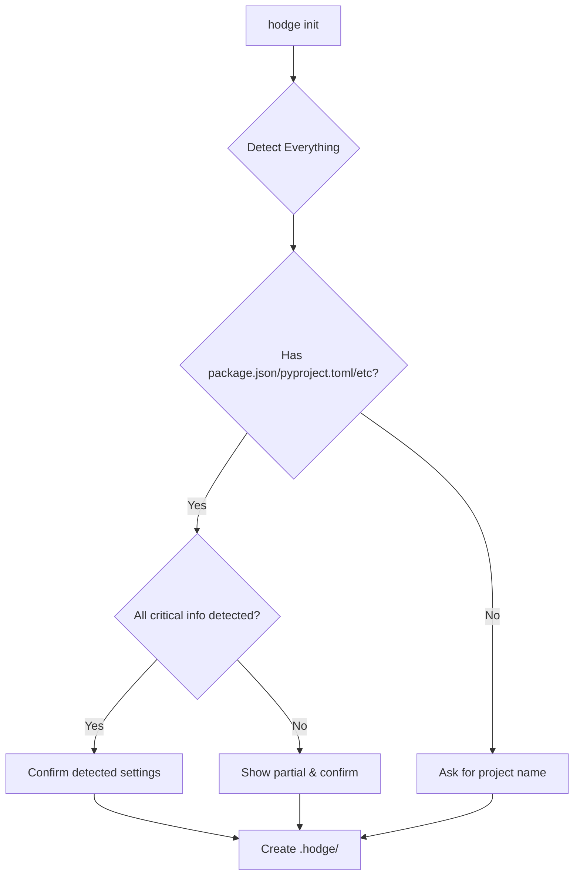

# Revised Recommendation: Smart Auto-Detection Init

## Updated Approach: Context-Aware Initialization

Instead of always asking for project name, `hodge init` becomes truly intelligent:

### Implementation Flow

```typescript
export async function initCommand(options: InitOptions) {
  // Run comprehensive auto-detection
  const detected = await detectEverything();
  
  // Determine what question to ask (if any)
  const question = determineQuestion(detected);
  
  let config: HodgeConfig;
  
  switch (question.type) {
    case 'CONFIRM_ONLY':
      // Existing project, everything detected
      config = await confirmDetected(detected);
      break;
      
    case 'NAME_ONLY':
      // Empty directory, need project name
      config = await askProjectName(detected);
      break;
      
    case 'PARTIAL_CONFIRM':
      // Some things detected, some missing
      config = await confirmPartial(detected);
      break;
      
    case 'NO_QUESTION':
      // Force mode or zero-config flag
      config = detected;
      break;
  }
  
  await createHodgeStructure(config);
  showSummary(config);
}
```

### Scenarios

#### 1. Existing Node.js Project (Full Detection)
```bash
$ hodge init

📦 Detected project configuration:
  Name:     my-awesome-app (from package.json)
  Type:     Node.js with TypeScript
  PM:       Linear (from environment)
  Tests:    Vitest
  Linting:  ESLint + Prettier
  Package:  pnpm

? Initialize Hodge with these settings? (Y/n) █
```

#### 2. Empty Directory
```bash
$ hodge init

📂 Empty directory detected

? Project name: (my-project) █
```

#### 3. Partial Detection
```bash
$ hodge init

📦 Detected configuration:
  Name:     flask-api (from git remote)
  Type:     Python
  Tests:    pytest
  ⚠️  No PM tool found

? Initialize Hodge with these settings? (Y/n) █
```

#### 4. Force/Quick Mode
```bash
$ hodge init --yes

✨ Initializing Hodge...
✅ Hodge initialized with auto-detected settings
```

### Decision Tree



### Smart Defaults Based on Detection

#### For Node.js Projects
```typescript
if (detected.type === 'node') {
  standards = {
    linting: detected.hasESLint ? 'strict' : 'recommended',
    testing: detected.testFramework || 'vitest',
    typescript: detected.hasTypeScript,
    formatting: detected.hasPrettier
  };
}
```

#### For Python Projects
```typescript
if (detected.type === 'python') {
  standards = {
    linting: detected.hasFlake8 || detected.hasRuff ? 'strict' : 'pep8',
    testing: detected.testFramework || 'pytest',
    typing: detected.hasMyPy,
    formatting: detected.hasBlack
  };
}
```

### Enhanced Detection Functions

```typescript
async function detectEverything(): Promise<DetectedConfig> {
  const [
    projectInfo,
    pmTool,
    gitInfo,
    dependencies,
    codeQuality,
    cicd
  ] = await Promise.all([
    detectProjectInfo(),
    detectPMTool(),
    detectGitConfig(),
    detectDependencies(),
    detectCodeQuality(),
    detectCICD()
  ]);

  return mergeDetectionResults({
    projectInfo,
    pmTool,
    gitInfo,
    dependencies,
    codeQuality,
    cicd
  });
}

function determineQuestion(detected: DetectedConfig): QuestionType {
  // Force mode
  if (process.argv.includes('--yes') || process.argv.includes('-y')) {
    return { type: 'NO_QUESTION' };
  }
  
  // Empty directory
  if (!detected.name && !detected.type) {
    return { type: 'NAME_ONLY' };
  }
  
  // Full detection
  if (detected.name && detected.type) {
    return { type: 'CONFIRM_ONLY', detected };
  }
  
  // Partial detection
  return { type: 'PARTIAL_CONFIRM', detected };
}
```

### Configuration File Generated

```json
{
  "name": "my-awesome-app",
  "version": "0.1.0",
  "createdAt": "2024-01-13T10:00:00Z",
  "detected": {
    "type": "node",
    "language": "typescript",
    "packageManager": "pnpm",
    "testRunner": "vitest",
    "linter": "eslint",
    "formatter": "prettier",
    "frameworks": ["react", "nextjs"],
    "pmTool": "linear"
  },
  "standards": {
    "mode": "balanced",
    "enforced": ["typescript", "eslint"],
    "recommended": ["testing", "documentation"]
  },
  "features": {
    "git": true,
    "ai": true,
    "patterns": true,
    "decisions": true
  }
}
```

### CLI Flags

```bash
hodge init              # Smart detection with confirmation
hodge init --yes        # Accept all detected settings
hodge init --wizard     # Force interactive mode
hodge init --minimal    # Create minimal .hodge structure
hodge init --force      # Overwrite existing .hodge
```

### Benefits of This Approach

1. **Truly One Question (or Zero)**: Only asks what's necessary
2. **Context-Aware**: Adapts to project state
3. **Fast**: Most projects initialize in <5 seconds
4. **Accurate**: Leverages all available information
5. **Transparent**: Shows what was detected
6. **Flexible**: Flags for different preferences

### Implementation Priority

1. **Phase 1**: Core detection + confirmation flow
2. **Phase 2**: Add --yes flag for CI/automation
3. **Phase 3**: Add --wizard for detailed setup

This approach delivers the best possible UX while maintaining the "one-question" goal!