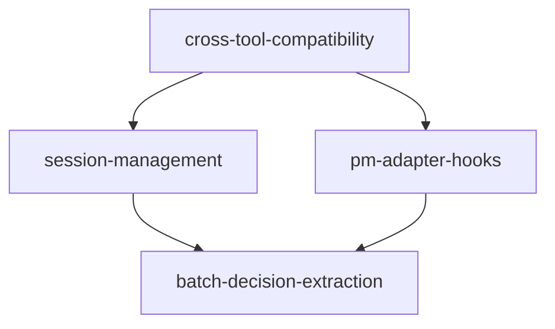

# Feature Implementation Roadmap

## Overview
This document links the four main features identified during the 2025-01-16 exploration session for improving Hodge's AI tool compatibility and workflow.

## Implementation Order

### Phase 1: Cross-Tool Compatibility (1-2 days)
**Feature**: `cross-tool-compatibility`
**Status**: Explored, ready to build
**Priority**: 1 (CRITICAL - enables everything else)

Makes Hodge work with any AI assistant through HODGE.md files.

```bash
# Next commands:
hodge build cross-tool-compatibility
hodge harden cross-tool-compatibility
hodge ship cross-tool-compatibility
```

### Phase 2: Session Management (1 day)
**Feature**: `session-management`
**Status**: Explored, depends on Phase 1
**Priority**: 2

Enables context persistence between AI sessions.

```bash
# After Phase 1 ships:
hodge build session-management
```

### Phase 3: PM Integration Hooks (2-3 days)
**Feature**: `pm-adapter-hooks`
**Status**: Explored, can build parallel to Phase 2
**Priority**: 3

Automates PM tool status updates and issue tracking.

```bash
# Can build in parallel:
hodge build pm-adapter-hooks
```

### Phase 4: Batch Decision Extraction (2-3 days)
**Feature**: `batch-decision-extraction`
**Status**: Explored, builds on other features
**Priority**: 4

Enhances decision extraction from long discussions.

```bash
# After core features stable:
hodge build batch-decision-extraction
```

## Feature Dependencies



## Context Recovery

When returning to work on these features:

1. **Check overall progress**:
   ```bash
   cat .hodge/features/README.md  # This file
   grep "^- \[" IMPLEMENTATION_PLAN.md | grep -v "x"  # Uncompleted tasks
   ```

2. **Load specific feature**:
   ```bash
   hodge status cross-tool-compatibility
   cat .hodge/features/cross-tool-compatibility/explore/exploration.md
   ```

3. **See all features**:
   ```bash
   ls -la .hodge/features/*/explore/exploration.md
   ```

## Key Decisions Made (2025-01-16)

1. ✅ Hybrid approach: Directories for storage, HODGE.md as view
2. ✅ HODGE.md primary with symlinks for compatibility
3. ✅ Session management now (not later)
4. ✅ Auto-decision on explore option (c)
5. ✅ Batch extraction with careful design
6. ✅ PM hooks now with Linear implementation
7. ✅ Cross-tool compatibility as first priority

## References

- **Implementation Plan**: `IMPLEMENTATION_PLAN.md`
- **Decisions**: `.hodge/decisions.md` (2025-01-16 entries)
- **Original Analysis**: Today's exploration session
- **Individual Features**: See each feature's explore directory

## Quick Status Check

```bash
# Run this to see all feature statuses:
for dir in .hodge/features/*/; do
  feature=$(basename "$dir")
  if [ -f "$dir/explore/exploration.md" ]; then
    echo "✓ $feature - explored"
  fi
  if [ -f "$dir/build/context.json" ]; then
    echo "  → building"
  fi
  if [ -f "$dir/ship/ship-summary.md" ]; then
    echo "  → shipped"
  fi
done
```